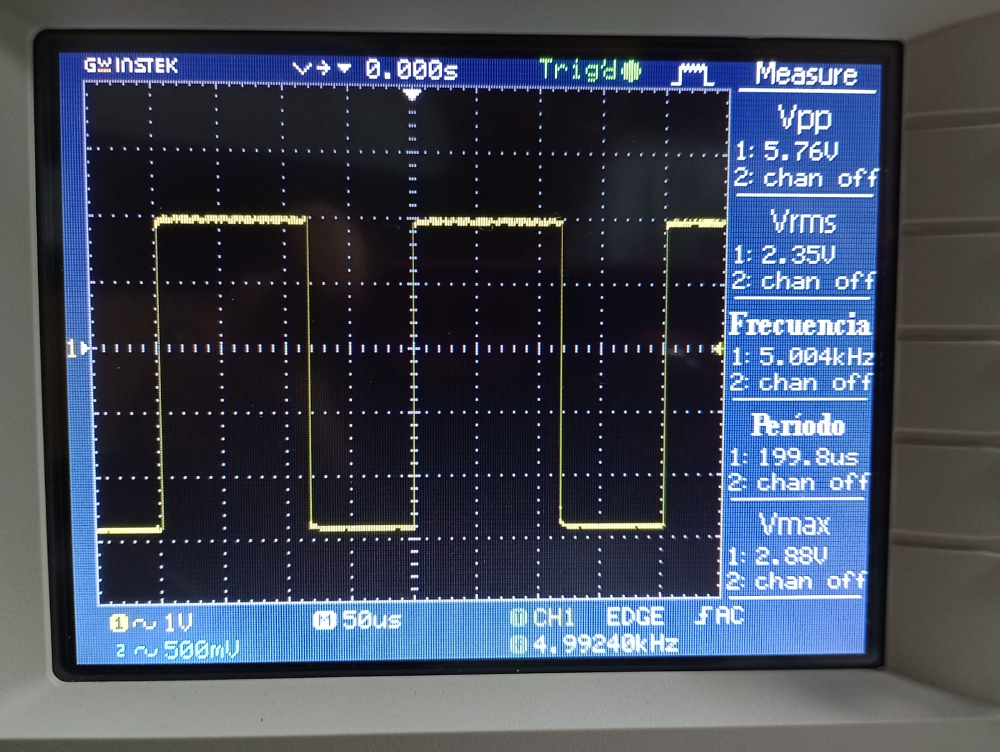
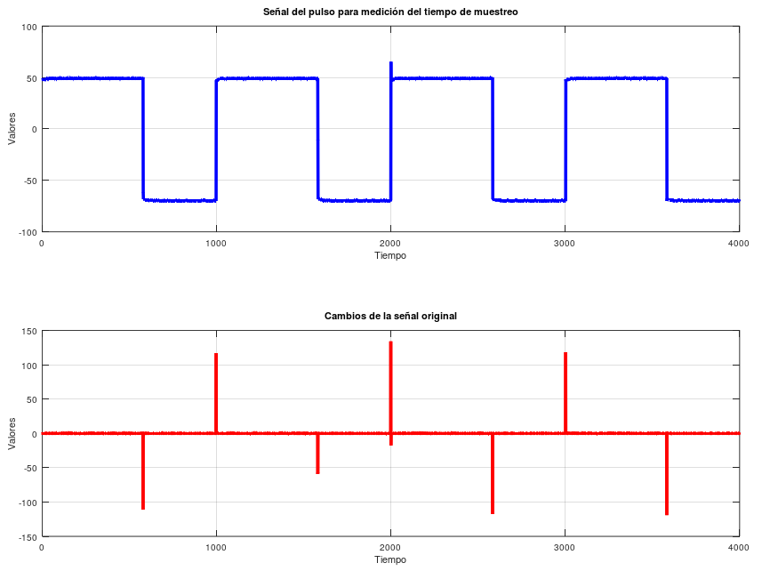

# T_Instru_ProyectoF

## Nota Divulgativa
La nota divulgativa se puede acceder por medio del siguiente link:
https://www.hackster.io/alexander-castro-oscar-rojas-sebastian-vega-sharon-valverde/diseno-y-comprobacion-de-un-sistema-de-adquisicion-de-datos-dce968

## Meidicion de Desempeño
### Tasa de Muestreo Efectiva y Jitter

En cuanto a la medición de la tasa de muestreo efectiva, se utilizó el timer interno del Arduino UNO mediante los comandos millis y micros, de manera que se mantenga un periodo de muestreo de $200 \mu s$, equivalente a $5kHz$. En este punto es obtuvo se revisó el periodo de muestreo mediante la medición con osciloscopio como se observa a continuación.

<p align="center">

</p>

Respecto a esta medición, se generaron los archivos .csv correspondientes, de manera que se lograra plantear los gráficos y así corroborar los valores de frecuencia y jitter presentes con base en sus cambios o flancos.

<p align="center">

</p>

Donde las diferencias entre los flancos fue de $\[419 \quad 583 \quad 1 \quad 418 \quad 1 \quad 583 \quad 419 \quad 580\]$ muestras, promediando en $375.5$ muestras. Por lo tanto, el jitter se obtuvo del siguiente cálculo al conocer el muestreo del osciloscopio utilizado (GW INSTEK GDS-1102-U - $250Msps$).

$$Jitter = \frac{375.5 \quad muestras}{250\times 10^{6} \quad muestras/seg}$$

$$Jitter = 1.502 \mu s$$

### Cuantificación de Error Estático y Dinámico
#### Error Estático

Para obtener el error Estatico de las mediciones de las escalas se toma el valor maximo de la escala y se alimenta el ADC. Se obtiene primero el valor con un multimetro de la entrada del ADC y luego se obtiene la lectura realizada por el ADC para obtener cual es el pocentaje de error entre las mediciones. 

| Escala (V) | Valor ADC (V) | Valor Multimetro (V) | Porcentaje de error (%) |
|:----------:|:-------------:|:--------------------:|:-----------------------:|
|     10m    |      4.76     |         4.83         |           1.47          |
|      1     |      4.78     |         4.82         |           0.84          |
|     2.5    |      4.98     |         5.04         |           1.20          |
|      5     |      4.96     |         4.83         |           2.62          |
|     10     |      4.98     |         4.92         |           1.20          |

Porcentaje de error promedio = 1.47 %

### Experimento, Medicion de Temperatura del Agua
Para el experimento se necesita un vaso con agua a temperatura superior a los 50 grados Celcius en donde se coloca la thermocupla a una escala de 10mV. Se requiere verificar la temperatura del vaso para luego dejar enfriar el vaso y obtener el comportamiento de la temperatura disminuyendo. Estos datos son guardados en la base de datos para poder ser procesados luego con un script de Python. Este script puede acceder a la base de datos y obtener los valores relevantes. Los ordena en listas que pueden ser manipuladas y con una funcion hecha por nosotros utilizando la ley de Newton de la temperatura se puede obtener el valor de K para 3 distintas mediciones junto con el K promedio de las 3 mediciones. 

<p align="center">

</p>
<p align="center">

</p>

#### Codigo Utilizado para hacer los Calculos
```python 
import pyodbc
import pandas as pd
from matplotlib import pyplot as plt


def read_db(muestraID,conexion):
    query = f"SELECT * FROM Dato WHERE muestraID='{muestraID}'"
    data = pd.read_sql(query, conexion)
    return data

# Funcion para crear la lista de datos obtenidos
def crear_lista(data):
    lista = []
    j = 0
    for i in data.valor:
        if (j >= 1):
            if (i > 1.1*lista[j-1]) or (i < (lista[j-1] - (1.2*lista[j-1]-lista[j-1]))):
                lista.append(lista[j-1])
            else:
                lista.append(i)
        else:
            lista.append(i)
        j += 1

    return lista

# Función para calcular la constante k utilizando diferencias finitas
def calcular_constante_k(lista_temperaturas, tasa_muestreo,temperatura_ambiente):
    k_values = []
    for i in range(1, len(lista_temperaturas)):
        delta_t = tasa_muestreo / 1000  # Convertir tasa de muestreo a segundos
        delta_T = lista_temperaturas[i - 1] - lista_temperaturas[i]
        k = delta_T / (delta_t * (lista_temperaturas[i - 1] - temperatura_ambiente))
        k_values.append(k)
    return sum(k_values) / len(k_values) if k_values else None

def main():
    cnxn_str = ("Driver={SQL Server};"
                "Server=SEBASPC;"
                "Database=proyecto3;"
                "Trusted_Connection=yes;")
    cnxn = pyodbc.connect(cnxn_str)

    cursor = cnxn.cursor()

    # Leer la Base de Datos
    data1 = read_db(13,cnxn)
    data2 = read_db(15,cnxn)
    data3 = read_db(16,cnxn)


    # Crear las Listas
    lista1 = crear_lista(data1)
    lista2 = crear_lista(data2)
    lista3 = crear_lista(data3)

    # Temperatura ambiente
    temperatura_ambiente = 25

    # Tasa de muestreo en milisegundos
    tasa_muestreo = 50

    # Calcular la constante k para cada lista de temperaturas
    k1 = round(calcular_constante_k(lista1, tasa_muestreo,temperatura_ambiente),5)
    k2 = round(calcular_constante_k(lista2, tasa_muestreo,temperatura_ambiente),5)
    k3 = round(calcular_constante_k(lista3, tasa_muestreo,temperatura_ambiente),5)

    # Tomar el promedio de las constantes k de los tres experimentos
    constante_k_promedio = round((k1 + k2 + k3) / 3,2)
    plt.plot(lista1,label = f"Prueba 1: {k1}")
    plt.plot(lista2,label = f"Prueba 2: {k2}")
    plt.plot(lista3,label = f"Prueba 3: {k3}")
    plt.xlabel("Muestras")
    plt.ylabel("Temperatura (C)")
    plt.legend()
    plt.show()
    print(f"Constante K de los primeros datos: {k1}")
    print(f"Constante K de los segundos datos: {k2}")
    print(f"Constante K de los terceros datos: {k3}")
    print(f"Constante k promedio: {constante_k_promedio}")

main()
```
